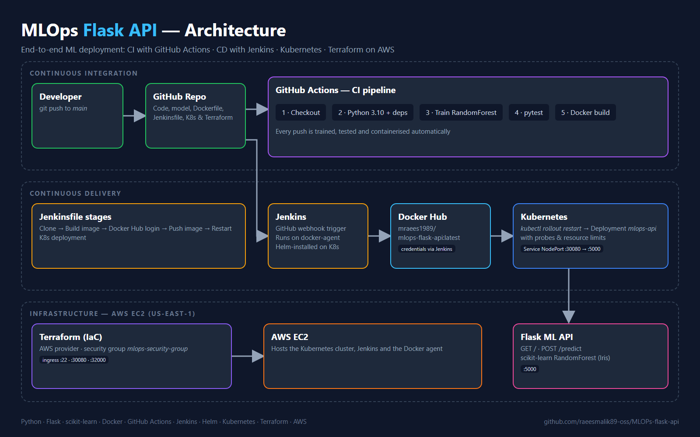

# MLOps Flask API

End-to-end MLOps project that trains a scikit-learn model, serves it through a Flask REST API, and ships it automatically with GitHub Actions (CI), Jenkins (CD), Docker Hub and Kubernetes. The AWS infrastructure is managed with Terraform.



---

## Tech Stack

| Area | Tools |
|------|-------|
| Machine Learning | Python, scikit-learn (RandomForest), joblib |
| API | Flask |
| Containers | Docker, Docker Hub |
| CI | GitHub Actions (train, test, build) |
| CD | Jenkins (Helm-installed, GitHub webhook trigger) |
| Orchestration | Kubernetes (Deployment + NodePort Service) |
| Infrastructure as Code | Terraform (AWS security group) |
| Cloud | AWS EC2 |

---

## Features

- Model training script (`train.py`) producing `model/model.pkl`
- Flask REST API with a `/predict` endpoint
- Automated tests with pytest
- CI pipeline: install → train → test → Docker build on every push
- CD pipeline: Jenkins builds and pushes the image to Docker Hub, then rolls out the Kubernetes deployment
- Kubernetes deployment with readiness/liveness probes and resource limits
- Terraform-managed AWS security group

---

## Pipelines

### CI — GitHub Actions (`.github/workflows/ci.yml`)
1. Checkout code
2. Set up Python 3.10 and install dependencies
3. Train the model
4. Run the test suite (`pytest`)
5. Build the Docker image

### CD — Jenkins (`Jenkinsfile`)
1. Clone repository
2. Build Docker image `mraees1989/mlops-flask-api:latest`
3. Log in to Docker Hub (Jenkins credentials `dockerhub-creds`)
4. Push image
5. `kubectl rollout restart deployment mlops-api`

Jenkins is installed on Kubernetes with Helm using `jenkins-values.yaml`, which adds the Kubernetes, Pipeline, Git and Docker plugins and mounts the host Docker socket.

---

## Project Structure

```text
MLOPs-flask-api/
├── .github/workflows/ci.yml   # GitHub Actions CI pipeline
├── app/app.py                 # Flask API
├── model/model.pkl            # Trained model
├── tests/test_app.py          # API tests
├── k8s/
│   ├── deployment.yaml        # Kubernetes Deployment
│   └── service.yaml           # NodePort Service (30080 → 5000)
├── terraform/main.tf          # AWS security group
├── docs/images/               # Architecture diagram
├── Dockerfile
├── Jenkinsfile                # Jenkins CD pipeline
├── jenkins-values.yaml        # Helm values for Jenkins
├── train.py                   # Model training
└── requirements.txt
```

---

## Run Locally

```bash
pip install -r requirements.txt
python train.py
python app/app.py
```

Run the tests:

```bash
pip install pytest
pytest -v tests/
```

## Run with Docker

```bash
docker build -t mlops-flask-api .
docker run -d -p 5000:5000 mlops-flask-api
```

## Deploy to Kubernetes

```bash
kubectl apply -f k8s/deployment.yaml
kubectl apply -f k8s/service.yaml
```

The API is then available on `http://<node-ip>:30080`.

## Provision AWS Resources

```bash
cd terraform
terraform init
terraform apply
```

---

## API

| Method | Endpoint | Description |
|--------|----------|-------------|
| GET | `/` | Health message |
| POST | `/predict` | Predict the Iris class from 4 features |

Example:

```bash
curl -X POST http://localhost:5000/predict \
  -H "Content-Type: application/json" \
  -d '{"features": [5.1, 3.5, 1.4, 0.2]}'
```

Response:

```json
{"prediction": 0}
```

---

## Author

**Muhammad Raees**

GitHub: https://github.com/raeesmalik89-oss
